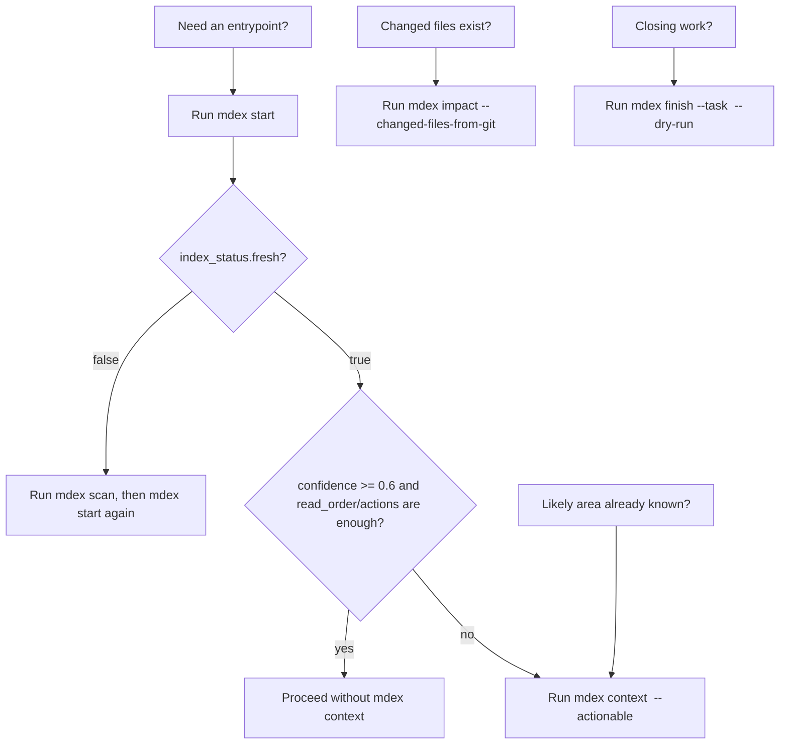

# mdex Agent Rules

`AGENT.md` は **execution heuristics の正本** です。  
`README.md` の手順を再掲せず、ここでは分岐判断だけを定義します。

## Responsibility Boundary

### 書いてよい内容

- 実行順序の判断基準（`start` / `context --actionable` / `impact` の使い分け）
- 迷ったときの優先順位
- エッジケースの扱い（例: changed files が既にある）

### 書いてはいけない内容

- コマンド契約の正本（`stdout/stderr JSON` 契約、primary keys）  
  `README.md` を参照
- frontmatter / `depends_on` / `relates_to` の入力規約  
  `docs/convention.md` を参照
- 実装・永続化の詳細  
  `docs/design.md` を参照

## Entry Decision: `start` vs `context --actionable`

| 状況 | 先に使うコマンド | 次にやること | 意図 |
|---|---|---|---|
| 入口候補が未確定（初回着手、探索範囲が広い） | `mdex start "<task>"` | 必要なら `mdex context "<task>" --actionable` | まず推奨入口を狭める |
| 入口候補が既にあるが、実行可能な次アクションを広く欲しい | `mdex context "<task>" --actionable` | `mdex first` / `mdex related` で局所深掘り | `start` を省略して時短 |
| changed files が既にある | `mdex impact <path...>` | `context --actionable` か `finish --dry-run` | 変更起点で読む順を再計算 |
| タスクを閉じる前 | `mdex finish --dry-run` | summary があるなら `--summary-file --scan` | 出口契約を先に確認 |

標準は `start -> context --actionable`。  
ただし入口が明確な場合は `context --actionable` から始めてよい。

## Shortest Safe Paths

| situation | shortest safe command | when it is enough |
|---|---|---|
| fresh DB and unknown entrypoint | `mdex start "<task>"` | use when `index_status.fresh == true` and `confidence >= 0.6` |
| known entrypoint / need actions | `mdex context "<task>" --actionable` | use when a likely area is already known |
| changed files exist | `mdex impact --changed-files-from-git` | use after edits to classify impacted docs |
| close task without applying summary | `mdex finish --task "<task>" --dry-run` | use to confirm no-op or update candidates |

Agents do not need to run `context` after `start` when `start` already returns enough `recommended_read_order`, `recommended_next_actions_v2`, and `actionable_digest`.

Run `scan` first when `index_status.fresh == false`, when DB resolution fails, or when the repo/index state is uncertain.



## If-Then Rules

| if | then | why |
|---|---|---|
| repo を初めて触る | `mdex scan` の後に必ず `mdex start` | 入口を推測しない |
| 索引の新しさが怪しい | 先に `mdex scan` | 読む順序の誤判定を減らす |
| 索引に local / old / archive ノイズが混ざった疑い | `mdex doctor` | 清掃が必要な状態を先に見える化する |
| 作業を始める | `mdex start "<task>"` | `recommended_read_order` と `recommended_next_actions` を得る |
| `start` より広い入口が欲しい | `mdex context "<task>" --actionable` | `actionable_digest` で docs / task history / code entrypoints / guardrails / suggested `rg` を分けて見る |
| 特定文書から読む順を決めたい | `mdex first <node-id>` | node 起点の read order を得る |
| 関連文書を掘りたい | `mdex related <node-id>` | 近接文脈を確認する |
| changed files がある | `mdex impact <path...>` または `mdex impact --changed-files-from-git` | `read_first` / `related_tasks` / `decision_records` を得る |
| タスクを閉じる | `mdex finish --task "<task>" --dry-run` | 更新候補を先に確認する |
| summary を適用する | `mdex finish --task "<task>" --summary-file <path> --scan` | apply と再 scan を一連で行う |
| task / decision を新規作成する | `mdex new task|decision` | frontmatter を手で作らない |
| `updated` だけ直したい | `mdex stamp <node-id or path>` | metadata 更新だけに留める |

## Priority When Unsure

1. `mdex scan`
2. index hygiene が怪しいなら `mdex doctor`
3. `mdex start`
4. changed files があるなら `mdex impact`
5. 終了前に `mdex finish --dry-run`

## Review Gate

実質的な mdex 変更を入れたら、完了前にサブエージェントレビューを呼ぶ。

対象例:

- CLI output contract / schema を変える
- ranking / context / start / impact / finish の判断ロジックを変える
- scan / SQLite / doctor / hygiene の挙動を変える
- README / AGENT / design の運用ルールを変える

レビュー依頼では bugs / contract regressions / CLI compatibility / Windows behavior / missing tests を確認させる。

## Prohibitions / Discouraged

- `mdex` を全文検索やコード理解の完全代替として扱わない
- `suggested_rg` が出ているときは、`command` + `args` を分けて扱い、mdex の候補を起点に `rg` で exact evidence を取りに行く
- prose 出力を期待しない。JSON field を読む
- `finish --summary-file` を summary なしで実行しない
- 通常の反映で `enrich` を優先しない。まず `finish` を使う
- `recommended_read_order` などの契約名に別名を付けない

## Contract Reminders

- 成功出力は stdout JSON、失敗出力は stderr JSON
- `finish --dry-run` は DB を更新しない
- `--db` 省略時の優先順は `README.md` / `docs/design.md` の記載に従う

## Verification

```bash
python -m pytest -q
```
